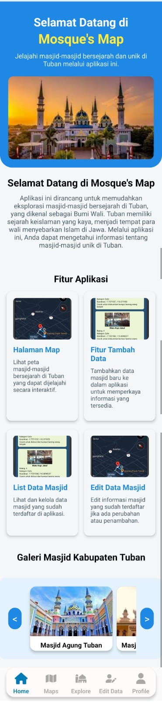
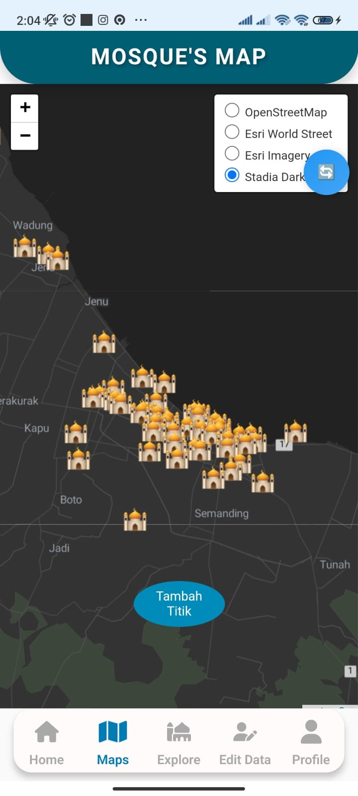
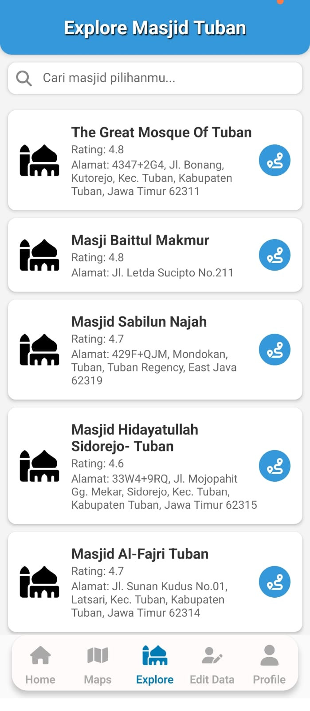
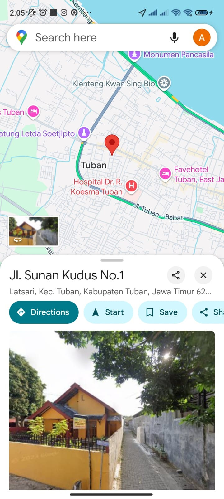
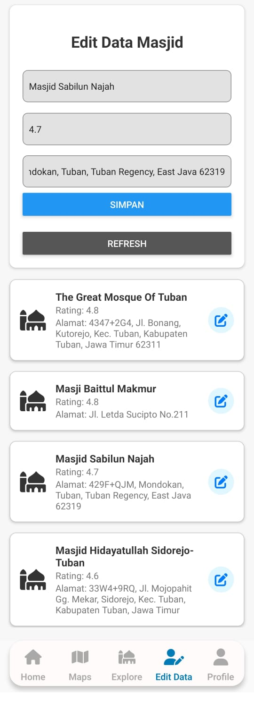

# Mosque's Map Kabupaten Tuban

**Nama produk**: Mosque's Map

**Deskripsi produk**: Mosque's Map adalah aplikasi yang dirancang untuk memudahkan pengguna dalam menemukan masjid-masjid yang ada di Kabupaten Tuban. Aplikasi ini menyediakan informasi lengkap mengenai lokasi masjid, rating, fasilitas, dan alasan mengapa masjid tersebut direkomendasikan. Dengan fokus pada tujuan branding Tuban sebagai "Bumi Wali", aplikasi ini bertujuan untuk memberikan panduan kepada masyarakat dan wisatawan yang ingin mengetahui lebih banyak tentang masjid-masjid yang ada di daerah ini. Mosque's Map menyajikan data yang terperinci tentang masjid, termasuk foto, alamat, dan rating dari pengguna sebelumnya, sehingga memudahkan dalam memilih tempat untuk beribadah, berdiskusi, atau kegiatan komunitas lainnya.

**Keunggulan**:
1. Menyediakan informasi lokasi masjid secara lengkap.
2. Fitur rating dan review dari pengguna untuk setiap masjid.
3. Visualisasi yang menarik dengan peta interaktif.
4. Pengguna dapat mencari masjid berdasarkan kriteria tertentu.
5. Menyediakan deskripsi singkat untuk setiap masjid yang terdaftar.

---

**Komponen pembangun produk**:
1. React Native
2. Leaflet
3. Node.js
4. Visual Studio Code
5. Android Studio
6. FontAwesome

**Sumber data**:
1. Google Maps
2. Data lokal Kabupaten Tuban

### Tampilan Aplikasi:

**HomeScreen**  
  

**MapScreen**  
  

**ListDataScreen**  
  

**EditDataScreen**  
  

**ProfilDataScreen**  
  

---

**Project Responsi**  
Amirul Fahmi Ash-Shiddiqie

---

